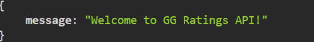
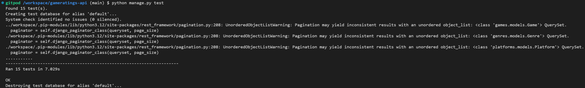

# GG Ratings API

### **Welcome to GG Ratings API README.**

View API:
[GG Ratings API](https://gameratings-api-d04888e8239b.herokuapp.com/)

View Frontend Live Site:
[GG Ratings](https://gameratings-frontend-2c9d8978da10.herokuapp.com/)

Frontend Repository:
[Frontend Repository](https://github.com/nicolemne/gameratings-frontend)

## **CONTENTS**
* [Project management](#project-management)
  * [Objective](#objective)
  * [Agile Methodology](#agile-methodology)
  * [Entity relationship diagram](#entity-relationship-diagram)
  * [Future Implementations](#future-implementations)

*  [Features of the GG Ratings API](#features-of-the-gg-ratings-api)
   * [Admin Access](#admin-access)
   * [User Access](#user-access)

* [Technologies](#technologies)
  * [Languages](#languages)
  * [Frameworks](#frameworks)
  * [Programs, Platforms and Services](#programs-platforms-and-services)
  * [Libraries and Dependencies](#libraries-and-dependencies)

* [Testing](#testing)
  * [Automated Tests](#automated-tests)
  * [Manual Testing](#manual-testing)
  * [Coverage Report](#coverage-report)
  * [Postman Report](#postman-report)
  * [PEP8 Python Linter](#pep8-python-linter)

* [Bugs](#bugs)
  * [Known bugs](#known-bugs)
  * [Fixed bugs](#fixed-bugs)

* [Deployment & Local Development](#deployment--local-development)
  * [Local Development](#local-development)
    * [GitHub and Gitpod](#github-and-gitpod)
    * [How to Fork](#how-to-fork)
    * [How to Clone](#how-to-fork)
  * [Create a Django REST Framework project](#create-a-django-rest-framework-project)
  * [PostgreSQL Code Institute](#postgres-code-institute)
  * [Setting up Environment Variables](#setting-up-environment-variables)
  * [Heroku](#heroku)

* [Credits](#credits)
  * [References and Resources](#references-and-resources)
  * [Content](#content)
  * [Acknowledgments](#acknowledgments)

# Project management

## Objective
The objective of this project is to develop a comprehensive backend API using Django REST Framework to support a React-based frontend application. The API will enable users to perform full CRUD (Create, Read, Update, Delete) operations on various resources related to game ratings and reviews.

Key functionalities include:

- User authentication and profile management
- Game reviews, comments, and likes
- Managing follower relationships

## Agile Methodology

The GG Ratings API project is managed using Agile methodology. The following tools and practices are used to ensure efficient project management:

- [Project Kanban Board](https://https://github.com/users/nicolemne/projects/9): The Kanban board helps us see the project's progress. It shows tasks in different stages like "To Do," "In Progress," and "Done," making it easy to track work and spot any issues.
- [Milestones](https://github.com/nicolemne/gameratings-api/milestones): Milestones are major goals and deadlines for the project. Each milestone represents a big step or deliverable that needs to be finished by a certain date. This helps plan and track the progress towards the project's main goals.
- [Issues](https://github.com/nicolemne/gameratings-api/issues): Issues are used to keep track of bugs, improvements, and other tasks. Each issue has a description, labels, and assignments to team members. This helps everyone know what needs to be done and who is responsible.

## Entity Relationship Diagram (ERD)

[Entity Relationship Diagram (ERD)](assets/readme/Entity%20Relationship%20Diagram%20(ERD).png)

### Model Relationships:
1. **User and Profile**: One-to-one relationship, each user has one profile.
2. **User and Post**: One-to-many relationship, users can create multiple posts.
3. **User and Comment**: One-to-many relationship, each user can make multiple comments.
4. **User and Like**: One-to-many relationship, each user can like multiple posts.
5. **User and Follower**: One-to-many relationship, a user can follow and be followed by multiple users.
6. **User and SavedGame**: One-to-many relationship, each user can save multiple games.
7. **Post and Game**: Many-to-one relationship, each post is related to one game.
8. **Post and Comment**: One-to-many relationship, each post can have multiple comments.
9. **Post and Like**: One-to-many relationship, each post can have multiple likes.
10. **Game and Genre**: Many-to-one relationship, each game belongs to one genre.
11. **Game and Platform**: Many-to-one relationship, each game is available on one platform.

## Future Implementations

- Filtering
- Image caching
- Character number limitations to comments and profile biography. 
- Tags

# Features of the GG Ratings API
The GG Ratings API consists of multiple apps, each with its unique model, views, URLs, and serializers. This structure provides a well-organized and scalable approach to managing the various aspects of the API.

## Admin Access
A superuser can log in through the Django admin site to manage the backend and administer the User model. This allows for efficient administration and control over user data and permissions. Additionally, only a superuser can add or delete new instances of the Platform and Genre models, however, all users can select a platform and genre when creating a new game instance. 

## User Access
Users can access the API data through https://gameratings-api-d04888e8239b.herokuapp.com/ and the corresponding URLs for each API endpoint.

- [Games](https://gameratings-api-d04888e8239b.herokuapp.com/games/): This endpoint provides access to the games data. Users can add new game instances, retrieve information about various games, including details such as title, genre, platform, and ratings.
- [Saved Games](https://gameratings-api-d04888e8239b.herokuapp.com/saved_games/): Users need to be logged in to view saved games. This endpoint allows users to save and manage their favourite games, enabling them to quickly access games they are interested in.
- [Platforms](https://gameratings-api-d04888e8239b.herokuapp.com/platforms/): This endpoint provides information about different gaming platforms. Users can explore various platforms and their associated games. Creation and deletion of platform instances can only be performed by a superuser.
- [Genres](https://gameratings-api-d04888e8239b.herokuapp.com/genres/): The genres endpoint allows users to retrieve information about different game genres. Users can filter and explore games based on their preferred genres. Creation and deletion of genre instances can only be performed by a superuser.
- [Profiles](https://gameratings-api-d04888e8239b.herokuapp.com/profiles/): This endpoint manages user profiles. Users can view and edit their profiles, including personal information and gaming preferences. 
- [Posts](https://gameratings-api-d04888e8239b.herokuapp.com/posts/): The posts endpoint allows users to create, delete, view, and manage posts related to games. This can include reviews, game news, and discussions.
- [Likes](https://gameratings-api-d04888e8239b.herokuapp.com/likes/): Users can like posts through this endpoint. It tracks user interactions with posts, enabling users to express their appreciation for content.
- [Comments](https://gameratings-api-d04888e8239b.herokuapp.com/comments/): This endpoint allows users to comment on posts. It enables discussions and feedback on various game-related topics.
- [Followers](https://gameratings-api-d04888e8239b.herokuapp.com/followers/): Users can follow other users through this endpoint. It helps in building a community by allowing users to follow their favourite content creators or fellow gamers.

Each of these endpoints is made to give a complete and easy-to-use way to work with game-related data. The API's model design keeps each feature separate, which makes it easier to manage and add new functions later on.

---

# Technologies and Credits

## Languages
- Python - Programming language for backend development
- Git - Version control

## Frameworks
- Django REST Framework - Toolkit for building Web APIs in Django
- Django - Python web framework for building web applications

## Programs, Platforms and Services
- Cloudinary - Image hosting
- Heroku - Cloud application platform for deployment
- PostgreSQL from Code Institute - Database management system
- Postman - Tool for testing APIs
- Coverage - Tool for measuring code coverage in tests
- Canva - Design tool for graphics and social media
- draw.io - Tool for drawing up the Entity Relationship Diagram (ERD)

## Libraries and Dependencies
For full list of requirements, please see [requirements.txt](requirements.txt).

- dj-rest-auth - Provides authentication and registration for Django REST Framework
- django-allauth - Integrated set of Django applications addressing authentication, registration, account management, and more
- django-cloudinary-storage - Cloudinary storage backend for Django
- django-filter - A reusable Django application for allowing users to filter querysets
- gunicorn - Python WSGI HTTP Server
- Pillow - Python Imaging Library for opening, manipulating, and saving many different image file formats
- psycopg2 - PostgreSQL database adapter for Python
- whitenoise - Simplifies the usage of static files in a Django application

# Testing

## Automated tests

Automated testing has been done in the following apps; *profiles*, *posts*, *platforms*, *genres*, *games* and *saved_games*. 

The tests consists of both ListViewTests and DetailViewTests that check listing and retrieving with valid & invalid IDs, which ensure functionality of listing and retrieving data in the application works as expected.

The pagination error is something I will look into at a later point in time.

## Manual testing
All API endpoints have been manually tested by creating, retrieving, updating, and deleting posts both through the Django Rest Framework admin site and in the development server.

Further extensive testing has been made during the development of the front-end application. This includes ensuring that all endpoints work correctly when integrated with the front-end UI. Detailed testing steps will be documented in the [TESTING.md](https://github.com/nicolemne/gameratings-frontend/blob/main/TESTING.md) file, which will be included in the frontend repository.

## Coverage Report

Coverage is a tool that can be installed in the terminal to measure how much of the code is executed during tests.
I have generated a Coverage report following these steps in the terminal:

1. `pip install coverage`
2. `coverage run --source='.' manage.py test`
3. `coverage report` to see summary

View Coverage report here: [page 1](/assets/readme/coverage1.png) and [page 2.](/assets/readme/coverage2.png)

## Postman Report
I have used Postman to generate a few tests to check some key functionality to my API. The tests include checking response times, response status, validating structure and data types. Tests were generated by Postman in the Postman application.

## PEP8 Python Linter
I have used [Code Institute Python Linter](https://pep8ci.herokuapp.com/#) to test all of my code to ensure it follows the PEP8 standards. 

This process has helped me to:

- Clean up and beautify my code
- Remove unnecessary comments
- Follow consistent naming conventions
- Ensure a good overall code quality and readability

### Overview

| **Component**  | **Model** | **Serializer** | **Views** | **URLs** | **Forms** | **Signals** |
|----------------|-----------|----------------|-----------|----------|-----------|-------------|
| **Comments**   | [Model](assets/readme/pylint_comment_model.png) | [Serializer](assets/readme/pylint_comment_serializer.png) | [Views](assets/readme/pylint_comment_views.png) | [URLs](assets/readme/pylint_comment_urls.png) |           |             |
| **Followers**  | [Model](assets/readme/pylint_followers_model.png) | [Serializer](assets/readme/pylint_followers_serializer.png) | [Views](assets/readme/pylint_followers_views.png) | [URLs](assets/readme/pylint_followers_urls.png) |           |             |
| **Games**      | [Model](assets/readme/pylint_games_model.png) | [Serializer](assets/readme/pylint_games_serializer.png) | [Views](assets/readme/pylint_games_views.png) | [URLs](assets/readme/pylint_games_urls.png) | [Forms](assets/readme/pylint_games_forms.png) |             |
| **Genres**     | [Model](assets/readme/pylint_genres_model.png) | [Serializer](assets/readme/pylint_genres_serializer.png) | [Views](assets/readme/pylint_genres_views.png) | [URLs](assets/readme/pylint_genres_urls.png) |           |             |
| **Likes**      | [Model](assets/readme/pylint_likes_model.png) | [Serializer](assets/readme/pylint_likes_serializer.png) | [Views](assets/readme/pylint_likes_views.png) | [URLs](assets/readme/pylint_likes_urls.png) |           |             |
| **Platforms**  | [Model](assets/readme/pylint_platforms_model.png) | [Serializer](assets/readme/pylint_platforms_serializer.png) | [Views](assets/readme/pylint_platforms_views.png) | [URLs](assets/readme/pylint_platforms_urls.png) | [Forms](assets/readme/pylint_platforms_forms.png) |             |
| **Posts**      | [Model](assets/readme/pylint_posts_model.png) | [Serializer](assets/readme/pylint_posts_serializer.png) | [Views](assets/readme/pylint_posts_views.png) | [URLs](assets/readme/pylint_posts_urls.png) | [Forms](assets/readme/pylint_posts_forms.png) | [Signals](assets/readme/pylint_posts_signals.png) |
| **Profiles**   | [Model](assets/readme/pylint_profiles_model.png) | [Serializer](assets/readme/pylint_profiles_serializer.png) | [Views](assets/readme/pylint_profiles_views.png) | [URLs](assets/readme/pylint_profiles_urls.png) |           |             |
| **Saved Games**| [Model](assets/readme/pylint_savedgames_model.png) | [Serializer](assets/readme/pylint_savedgames_serializer.png) | [Views](assets/readme/pylint_savedgames_views.png) | [URLs](assets/readme/pylint_savedgames_urls.png) |           |             |

# Bugs

## Known Bugs

No known bugs.

## Fixed Bugs

The documentation I have used to solve some of the bug fixes is listed in the References and Resources section. 

### Bug fix 1

After updating the permissions to only allow superusers to handle game instance deletion, I ran into an error: `the 'Game' object has no attribute 'owner'`. 

[Bug 1: AttributeError Game object](/assets/readme/games-no-owner.png)

I thought that by removing `return obj.owner == request.user` in the custom permission "IsAdminOrOwnerOrReadOnly", it would solve the issue. Instead, I got a new error saying: `No such column: posts_post.game_id`.

[Bug 1: OperationalError](/assets/readme/no-such-column.png)

#### **Solution**: 
I added `default=1` to the game field in the Post model so that the database knows what game to assign to existing posts during the migration process. This ensures that every post has a game assigned, even for posts that were created before the game field was added.

---

### Bug fix 2

When I implemented the platform app and model, I had written the code to import the Game model from the games app with a variable with a Foreign Key assigned to it. The Game model was also referencing the Platform model, and since they were both importing each other I ran into a circular import loop, which I learned could be fixed by removing the model imports and adding a string in the variable, to only import when neccesary.

[Bug 2: Circular import](/assets/readme/circular-import.png)

#### **Solution**:
Instead of using a direct import, I added a string reference in the ForeignKey: 
`platform = models.ForeignKey('platforms.Platform', on_delete=models.CASCADE, related_name='games')`

This solved one issue, but instead, I got a new error that said: `OperationalError: no such column: games_game.platform_id`, which I believe indicated that the old reference to the platform in the database is interfering with the new one. So after some research, I concluded that I had to remove the migrations from the games and platforms apps and delete the SQL database file.

**The below steps are what helped me clear the migrations to implement my new changes to the Game model**:

- `rm xxx*/migrations/000*.py`: clear the migrations of all my current apps so I can make new migrations. (*xxx being the app name)
- `rm db.sqlite3`: delete the SQLite database file

---

### Bug fix 3

When I tried to view the details of a saved game, an error occurred: `AttributeError: 'SavedGame' object has no attribute 'owner'`

I learned this error happened because the custom permission class was checking for an owner attribute on the SavedGame model. However, the SavedGame model uses a user attribute to refer to the person who saved the game.

[Bug 3: AttributeError SavedGame object](/assets/readme/saved_games-object-has-no-owner.png)

#### **Solution**:

This issue was resolved by writing a new permission class IsUserorReadOnly that checks if it's the same user that saved the game, that can edit or delete the saved game from their library. I imported my new permission IsUserorReadOnly and replaced IsOwnerOrReadOnly in the SavedGameDetail view.

---

### Bug fix 4

While running tests for the PostListView, I encountered a runtime warning: DateTimeField Platform.release_date received a naive datetime while time zone support is active. I learned that this warning occurs because the datetime.now() function returns a naive datetime object, which does not include any timezone information. Django expects datetime objects to be timezone-aware to handle time-related data correctly.

[Bug 4: RuntimeWarning: DateTimeField](/assets/readme/runtimewarning.png)

#### **Solution**:

To fix this issue, I used the make_aware function from django.utils.timezone. This function converts a naive datetime object to a timezone-aware datetime object, making it compatible with Django's timezone support.

# Deployment & Local Development

## Local Development

#### **GitHub & Gitpod**
My GitHub repository gameratings-api was created using the following template: [Code-Institute-Org/ci-full-template](https://github.com/Code-Institute-Org/ci-full-template). I've used Gitpod as my cloud-based IDE (integrated development environment) which operates entirely online.

1. Install the Gitpod extension for Google Chrome. This extension enables you to launch a workspace directly from your GitHub repository by clicking the "Open with Gitpod". 
2. Once the workspace is opened through GitHub (first time), continue accessing and running the project from Gitpod's interface on their website for subsequent coding sessions.

When working with Git, make frequent and small commits. Use these commands for committing changes:
- `git add .`: stages all modified files
- `git commit -m "A message explaining your commit"`: commits the changes to the local repository
- `git push`: pushes the committed changes to your GitHub repository

#### **How to Fork**

1. Login (or sign up) to GitHub.
2. Go to the repository for this project [here](https://github.com/nicolemne/gameratings-api)
3. Click the Fork button in the top right corner.

#### **How to Clone**

If you wish to clone my project, please see the following steps below:

1. Navigate to GitHub: https://github.com/nicolemne/gameratings-api
2. Select the 'Clone' button
3. Copy the URL or download it as a ZIP file
4. Use git clone + the URL in your terminal, or unpack the ZIP containing the project

### **Create a Django REST Framework Project**
1. Install Django along with supporting libraries such as: Gunicorn, Cloudinary, psycopg2, Pillow, and Allauth.
2. Create project: `django-admin startproject project_name`
3. Similarly, create app: `python manage.py startapp app_name`
4. Create file for requirements: `pip freeze --local > requirements.txt` 
   - Remember to repeat this step everytime you install a new library or dependency
5. Add your apps to `INSTALLED_APPS` in settings.py file: `'app_name',`
6. Follow the steps in [Setting up Environment Variables](#setting-up-environment-variables) to set up your:
   - DEV
   - SECRET_KEY
   - DATABASE_URL
   - ALLOWED_HOSTS
   - CLOUDINARY_URL
7. Migrate changes: `python manage.py migrate`
8. Run server locally: `python manage.py runserver`

### **Setting up Environment Variables**

1. Create an env.py and Procfile file. These should all be located at the top level of your project directory. 
   - In the terminal: `touch Procfile`
   - In the terminal: `touch env.py`
2. Add env.py to the .gitignore file.
3. In env.py import the os library: `import os`
4. In env.py, below import os, add `os.environ["DATABASE_URL"] = "databaseurl"`
5. In env.py, below import os, add `os.environ["SECRET_KEY"] = "YourSecretKey"` or `os.environ.setdefault("SECRET_KEY", "YourSecretKey")`
6. Go to settings.py and replace the default Django secret key with `SECRET_KEY = os.environ.get(SECRET_KEY)`
7. In Procfile add `web: gunicorn <project_name>.wsgi` (without the <>)

### **Heroku**
1. Sign in to Heroku or create an account if you don't already have one.
2. Click 'New' to create a new Heroku app. Choose a name for your app and choose your region (e.g., Europe).
3. Go to the app settings tab and click on 'Reveal Config Vars'.
4. Add a configuration variable named DATABASE_URL and paste your database URL (same as the one in your env.py).
5. Add a SECRET_KEY configuration variable with the secret key from your env.py file.
6. In the deploy tab, use GitHub as the deployment method. Find your repository by name and connect. Deploy the main branch from the manual deployment section.

### PostgreSQL from Code Institute
I've used the PostgreSQL database provided by Code Institute. If you're a Code Institute student, you can follow the below steps to set up your database for your project.

1. Navigate to [PostgreSQL from Code Institute](https://dbs.ci-dbs.net/) 
2. Enter the email address you use to sign in to the LMS
3. Wait for an email from the Code Institute Bot
4. The DATABASE_URL will be provided inside the email for you to copy into your project env.py and Heroku
5. Read the email for further instructions on how to manage your databases

# Credits

## References and Resources
#### Django
- [Django: Project](https://www.djangoproject.com/)
- [Django: Signals](https://docs.djangoproject.com/en/5.0/topics/signals/)
- [Django: Aggregation](https://docs.djangoproject.com/en/5.0/topics/db/aggregation/)
- [Django: QuerySet](https://docs.djangoproject.com/en/4.0/ref/models/querysets/#annotate)
- [Django: Validators](https://docs.djangoproject.com/en/5.0/ref/validators/)
- [Django: Query Expressions](https://docs.djangoproject.com/en/5.0/ref/models/expressions/#f-expressions)
- [django-filter](https://django-filter.readthedocs.io/en/stable/)
- [django-filter Integration with DRF](https://django-filter.readthedocs.io/en/stable/guide/rest_framework.html)
- [Django: Widgets](https://docs.djangoproject.com/en/5.0/ref/forms/widgets/)
- [DateTimeField Django Forms](https://www.geeksforgeeks.org/datetimefield-django-forms/)
- [Django: Adding fields to existing models](https://docs.djangoproject.com/en/5.0/topics/migrations/#adding-fields-to-existing-models)
- [Django: Custom Permissions](https://docs.djangoproject.com/en/5.0/topics/auth/customizing/#custom-permissions)
- [Django: Naive and aware datetime objects](https://docs.djangoproject.com/en/4.0/topics/i18n/timezones/#naive-and-aware-datetime-objects)
- [Django: make_aware](https://docs.djangoproject.com/en/4.0/ref/utils/#django.utils.timezone.make_aware)
- [Django admin site](https://docs.djangoproject.com/en/5.0/ref/contrib/admin/)
- [Django ModelAdmin list_display](https://docs.djangoproject.com/en/5.0/ref/contrib/admin/#django.contrib.admin.ModelAdmin.list_display)

#### Other
- [Heroku](https://heroku.com/)
- [Cloudinary](https://cloudinary.com/)
- [medium.com: Avoiding circular imports](https://medium.com/brexeng/avoiding-circular-imports-in-python-7c35ec8145ed)
- [medium.com: Implementing star rating](https://medium.com/geekculture/django-implementing-star-rating-e1deff03bb1c)
- [Whitenoise](https://whitenoise.readthedocs.io/en/latest/)
- [Coverage](https://micropyramid.com/blog/check-test-coverage-in-django-code-with-coveralls)
- [Postman](https://www.postman.com/)

## Content
I have personally developed all the code in this project, demonstrating my dedication and commitment to its creation. While working on this project, I utilized various resources, including those acknowledged in the References and Resources, which provided valuable insights and inspiration. Additionally, I have incorporated some code from the Learning DRF-API and Moments walkthrough projects to enhance the functionality and quality of this project.

## Acknowledgments
I would like to thank and acknowledge the following people, who have shown invaluable support throughout my fifth project:

- Dan Ford, not only as my boyfriend but also as my biggest supporter. His unwavering encouragement and belief in my abilities have been a constant source of motivation and inspiration. I am truly grateful to have him by my side throughout this journey.
- Antonio Rodriquez, my new mentor at Code Institute. Antonio has been incredibly helpful, showing great patience and providing informative guidance throughout the project. His expertise and support have made a significant impact on my learning and development.
- Joseph Doble has offered valuable assistance with sourcing relevant information and explaining the intricacies of various concepts. His help has been greatly appreciated.
- Tutor Support, their patience and willingness to address my endless questions have been instrumental in my learning process and growth.